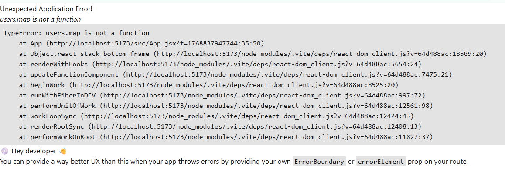
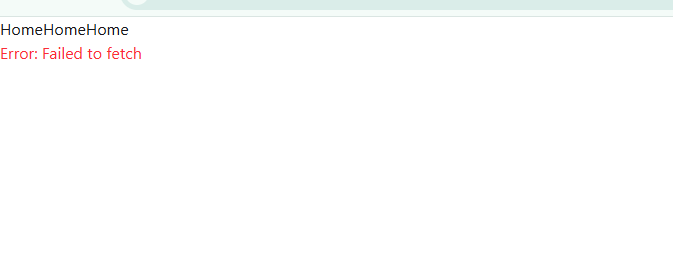
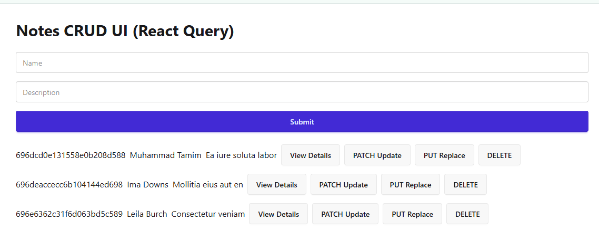

<h1 align="center">Tanstack Query Notes</h1>

- [Introduction:](#introduction)
    - [Installation:](#installation)
    - [Why Use TanStack Query?](#why-use-tanstack-query)
- [HTTP Operations (CRUD):](#http-operations-crud)
    - [Why useQuery is NOT for POST, PUT/PATCH, DELETE:](#why-usequery-is-not-for-post-putpatch-delete)
    - [Example 1 (Query + Mutations Operations in Tanstack Query):](#example-1-query--mutations-operations-in-tanstack-query)

# Introduction:
TanStack Query is a server-state management library. It can handle data fetching, caching, background refetching, loading & error states, pagination & infinite scrolling, mutations and more. 

**Note:** It can completely replace manual useEffect and useState for data fetching in react applications.

### Installation: 

```bash
npm i @tanstack/react-query
```

### Why Use TanStack Query?

- without fetch + useState, and useEffect: 

```js
import { useEffect, useState } from "react";

function App() {
  const [users, setUsers] = useState([]);
  const [pending, setPending] = useState(true);
  const [error, setError] = useState(null);

  useEffect(() => {
    fetch("https://jsonplaceholder.typicode.com/use")
      .then((res) => res.json())
      .then((data) => {
        setUsers(data);
        setPending(false);
      })
      .catch((err) => {
        setError(err.message);
        setPending(false);
      });
  }, []);

  if (pending) {
    return <h2 className="text-center text-5xl">Loading......</h2>;
  }

  if (error) {
    return <h2 className="text-red-500">Error: {error}</h2>;
  }

  return (
    <div>
      {users.map((user) => <div key={user.id}>
        <p>{user.name} | {user.email}</p>
      </div>)}
    </div >
  );
}

export default App;
```



Note: this version don't catch fetch error properly becaus fetch only throw error for network failure, not for 4xx or 5xx response status. for that type of error handling we need to check response.ok property. 

```js
import { useEffect, useState } from "react";

function App() {
  const [users, setUsers] = useState([]);
  const [pending, setPending] = useState(true);
  const [error, setError] = useState(null);

  useEffect(() => {
    fetch("https://jsodfdfdfdfdfdfder.typicode.com/use")
      .then((res) => {
        if (!res.ok) {
          throw new Error(`Request failed with status ${res.status}`);
        }
        return res.json();
      })
      .then((data) => {
        setUsers(data);
        setPending(false);
      })
      .catch((err) => {
        setError(err.message);
        setPending(false);
      });
  }, []);

  if (pending) {
    return <h2 className="text-center text-5xl">Loading......</h2>;
  }

  if (error) {
    return <h2 className="text-red-500">Error: {error}</h2>;
  }

  return (
    <div>
      {users.map((user) => (
        <div key={user.id}>
          <p>{user.name} | {user.email}</p>
        </div>
      ))}
    </div>
  );
}

export default App;
```



- with axios + useState, and useEffect: 

```js
import { useEffect, useState } from "react";
import axios from "axios";

function App() {
  const [users, setUsers] = useState([]);
  const [pending, setPending] = useState(true);
  const [error, setError] = useState(null);

  useEffect(() => {
    axios.get("https://wrongURl.com/users")
      .then((res) => {
        setUsers(res.data);
        setPending(false);
      })
      .catch((err) => {
        setError(err.message);
        setPending(false);
      });
  }, []);

  if (pending) {
    return <h2 className="text-center text-5xl">Loading......</h2>;
  }

  if (error) {
    return <h2 className="text-red-500">Error: {error}</h2>;
  }

  return (
    <div>
      {users.map((user) => (
        <div key={user.id}>
          <p>
            {user.name} | {user.email}
          </p>
        </div>
      ))}
    </div>
  );
}

export default App;
```


Note: This axios version is better than fetch version because axios throw error for 4xx and 5xx response status by default.

- with Tanstack Query + axios: 

```js
import { StrictMode } from 'react'
import { createRoot } from 'react-dom/client'
import { QueryClient, QueryClientProvider } from "@tanstack/react-query";
import './index.css'
import App from './App.jsx'

createRoot(document.getElementById('root')).render(
  
  <StrictMode>
    <QueryClientProvider client={queryClient}>
        <App />
    </QueryClientProvider>  
  </StrictMode>,
)
```

```js
import axios from "axios";
import { useQuery } from "@tanstack/react-query";

const fetchUsers = async () => {
  const res = await axios.get("https://.typicode.com/users");
  return res.data;
};

function App() {
  const { data: users, isLoading, isError, error } = useQuery({
    queryKey: ["users"],
    queryFn: fetchUsers,
  });

  if (isLoading) {
    return <h2 className="text-center text-5xl">Loading......</h2>;
  }

  if (isError) {
    return <h2 className="text-red-500">Error: {error.message}</h2>
  }

  return (
    <div>
      {users.map((user) => <div key={user.id}>
        <p>{user.name} | {user.email}</p>
      </div>
      )}
    </div>
  );
}

export default App;
```


Note: tanstack query is really advance, if we put wrong url in the axios get method, it will automatically retry 3 times before throwing error. 


fix url version: 

```js
import axios from "axios";
import { useQuery } from "@tanstack/react-query";

const fetchUsers = async () => {
  const res = await axios.get("https://jsonplaceholder.typicode.com/users");
  return res.data;
};

function App() {
  const { data: users, isLoading, isError, error } = useQuery({
    queryKey: ["users"],
    queryFn: fetchUsers,
  });

  if (isLoading) {
    return <h2 className="text-center text-5xl">Loading......</h2>;
  }

  if (isError) {
    return <h2 className="text-red-500">Error: {error.message}</h2>
  }

  return (
    <div>
      {users.map((user) => <div key={user.id}>
        <p>{user.name} | {user.email}</p>
      </div>
      )}
    </div>
  );
}

export default App;
```


here, we can now see tanstack query by default handle loading, error and data states. we don't need to manually create useState and useEffect for that.

# HTTP Operations (CRUD): 

| HTTP        | TanStack      |
| ----------- | ------------- |
| GET         | `useQuery`    |
| POST        | `useMutation` |
| PUT / PATCH | `useMutation` |
| DELETE      | `useMutation` |


Note: In tanstack query GET operation is handled by useQuery hook and its called** Query operation**. while POST, PUT/PATCH and DELETE operations are handled by useMutation hook and its called **Mutation Operation**.

### Why useQuery is NOT for POST, PUT/PATCH, DELETE: 

**useQuery:**
- runs automatically on mount
- caches data
- refetches in background

But POST, PUT/PATCH, DELETE:
- should run only when user clicks
- should not auto-run
- should not be cached

That's why mutations exist. 

### Example 1 (Query + Mutations Operations in Tanstack Query): 

- Frontend: 

```js
import React, { useState } from "react";
import toast from "react-hot-toast";
import axios from "axios";
import { useQuery, useMutation, useQueryClient } from "@tanstack/react-query";

function App() {
  const queryClient = useQueryClient();
  const [id, setId] = useState(null);

  // -----------------------------
  // Queries
  // -----------------------------

  // Get all notes
  // const {data: notes = [], ........} we can set default value of notes to empty array 
  // to avoid error before data loads, is optional because we used isLoading check below for this case
  const { data: notes, isLoading, isError, error } = useQuery({
    queryKey: ["notes"],
    queryFn: async () => {
      const res = await axios.get("http://localhost:3000/notes");
      return res.data;
    },
  });

  // Get single note
  const { data: singleNotes } = useQuery({
    queryKey: ["note", id],
    queryFn: async () => {
      const res = await axios.get(`http://localhost:3000/notes/${id}`);
      return res.data;
    },
    enabled: !!id, // only fetch if id exists
  });

  // -----------------------------
  // Mutations
  // -----------------------------

  // Create Note
  const createNoteMutation = useMutation({
    mutationFn: async (newNote) => axios.post("http://localhost:3000/notes", newNote),
    onSuccess: () => {
      toast.success("Note Added");
      queryClient.invalidateQueries(["notes"]); // refetch all notes
    },
  });

  // PATCH Note
  const patchNoteMutation = useMutation({
    mutationFn: async ({ id, patchObj }) =>
      axios.patch(`http://localhost:3000/notes/${id}`, patchObj),
    onSuccess: () => {
      toast.success("Note Updated (PATCH)");
      queryClient.invalidateQueries(["notes"]);
      queryClient.invalidateQueries(["note", id]);
    },
  });

  // PUT Note
  const putNoteMutation = useMutation({
    mutationFn: async ({ id, putObj }) =>
      axios.put(`http://localhost:3000/notes/${id}`, putObj),
    onSuccess: () => {
      toast.success("Note Updated (PUT)");
      queryClient.invalidateQueries(["notes"]);
      queryClient.invalidateQueries(["note", id]);
    },
  });

  // DELETE Note
  const deleteNoteMutation = useMutation({
    mutationFn: async (id) => axios.delete(`http://localhost:3000/notes/${id}`),
    onSuccess: () => {
      toast.success("Note Deleted");
      queryClient.invalidateQueries(["notes"]);
    },
  });

  // -----------------------------
  // Handlers
  // -----------------------------

  const handleSubmit = (e) => {
    e.preventDefault();
    const name = e.target.name.value;
    const description = e.target.description.value;
    createNoteMutation.mutate({ name, description });
    e.target.reset();
  };

  const handlePatchUpdate = (e) => {
    e.preventDefault();
    const patchObj = {
      name: e.target.name.value,
      description: e.target.description.value,
    };
    patchNoteMutation.mutate({ id, patchObj });
  };

  const handlePutUpdate = (e) => {
    e.preventDefault();
    const putObj = {
      name: e.target.name.value,
      description: e.target.description.value,
    };
    putNoteMutation.mutate({ id, putObj });
  };

  const handleDelete = (id) => {
    deleteNoteMutation.mutate(id);
  };

  if (isLoading) {
    return <h2 className="text-center text-5xl">Loading......</h2>;
  }

  if (isError) {
    return <h2 className="text-red-500">Error: {error.message}</h2>
  }

  return (
    <div className="p-8 max-w-6xl mx-auto">
      <h1 className="text-3xl font-bold mb-6">Notes CRUD UI (React Query)</h1>

      {/* Form */}
      <form onSubmit={handleSubmit} className="mb-6 space-y-4">
        <input type="text" name="name" placeholder="Name" className="input w-full" />
        <input
          type="text"
          name="description"
          placeholder="Description"
          className="input w-full"
        />
        <input type="submit" value="Submit" className="btn w-full btn-primary" />
      </form>

      {/* Notes List */}
      <div className="space-y-4">
        {notes.map((note) => (
          <div key={note._id} className="flex items-center gap-2">
            <p>{note._id}</p>
            <p>{note.name}</p>
            <p>{note.description}</p>

            <button
              className="btn"
              onClick={() => {
                setId(note._id);
                document.getElementById("my_modal_1").showModal();
              }}
            >
              View Details
            </button>

            <button
              className="btn"
              onClick={() => {
                setId(note._id);
                document.getElementById("my_modal_2").showModal();
              }}
            >
              PATCH Update
            </button>

            <button
              className="btn"
              onClick={() => {
                setId(note._id);
                document.getElementById("my_modal_3").showModal();
              }}
            >
              PUT Replace
            </button>

            <button className="btn" onClick={() => handleDelete(note._id)}>
              DELETE
            </button>
          </div>
        ))}
      </div>

      {/* View Modal */}
      <dialog id="my_modal_1" className="modal">
        <div className="modal-box">
          <p>id: {singleNotes?._id}</p>
          <p>Name: {singleNotes?.name}</p>
          <p>Description: {singleNotes?.description}</p>
        </div>
        <form method="dialog" className="modal-backdrop">
          <button>close</button>
        </form>
      </dialog>

      {/* PATCH Modal */}
      <dialog id="my_modal_2" className="modal">
        <div className="modal-box">
          <form onSubmit={handlePatchUpdate} className="mb-6 space-y-4">
            <input type="text" name="name" defaultValue={singleNotes?.name} className="input w-full" />
            <input type="text" name="description" defaultValue={singleNotes?.description} className="input w-full" />
            <input type="submit" value="Submit" className="btn w-full btn-primary" />
          </form>
        </div>
        <form method="dialog" className="modal-backdrop">
          <button>close</button>
        </form>
      </dialog>

      {/* PUT Modal */}
      <dialog id="my_modal_3" className="modal">
        <div className="modal-box">
          <form onSubmit={handlePutUpdate} className="mb-6 space-y-4">
            <input type="text" name="name" defaultValue={singleNotes?.name} className="input w-full" />
            <input type="text" name="description" defaultValue={singleNotes?.description} className="input w-full" />
            <input type="submit" value="Submit" className="btn w-full btn-primary" />
          </form>
        </div>
        <form method="dialog" className="modal-backdrop">
          <button>close</button>
        </form>
      </dialog>
    </div>
  );
}

export default App;
```



- Backend: 
  
```js
const express = require('express')
const cors = require('cors')
require('dotenv').config()
const { MongoClient, ServerApiVersion, ObjectId } = require('mongodb');

const port = process.env.PORT || 3000

const app = express()
app.use(cors()) // use cors middleware
app.use(express.json()) // use express middleware


const client = new MongoClient(process.env.MONGODB_URI, {
    serverApi: {
        version: ServerApiVersion.v1,
        strict: true,
        deprecationErrors: true,
    }
});

async function run() {
    await client.connect();

    const notesCollection = client.db("notesDB").collection('notes')


    // POST - create new note
    app.post('/notes', async (req, res) => {
        const note = req.body;
        const result = await notesCollection.insertOne(note);
        res.send(result);
    });


    // GET all notes
    app.get('/notes', async (req, res) => {
        const notes = await notesCollection.find({}).toArray();
        res.send(notes);
    });

    // GET a single note
    app.get('/notes/:id', async (req, res) => {
        const id = req.params.id
        const filter = { _id: new ObjectId(id) }
        const result = await notesCollection.findOne(filter);
        res.send(result);
    });


    // PATCH - partial update
    app.patch('/notes/:id', async (req, res) => {
        const id = req.params.id
        const filter = { _id: new ObjectId(id) }
        const updatedData = req.body;
        const updatedDoc = {
            $set: {
                name: updatedData.name,
                description: updatedData.description
            }
        }

        const result = await notesCollection.updateOne(filter, updatedDoc);
        res.send(result);
    });

    // PUT - full replace
    app.put('/notes/:id', async (req, res) => {
        const id = req.params.id
        const filter = { _id: new ObjectId(id) }
        const updatedData = req.body;
        const options = { upsert: true }

        const result = await notesCollection.replaceOne(filter, updatedData, options);
        res.send(result);
    });


    // DELETE
    app.delete('/notes/:id', async (req, res) => {
        const result = await notesCollection.deleteOne({ _id: new ObjectId(req.params.id) });
        res.send(result);
    });

    // Send a ping to confirm a successful connection
    await client.db("admin").command({ ping: 1 });
    console.log("Pinged your deployment. You successfully connected to MongoDB!");
}
run().catch(console.dir);


app.get('/', (req, res) => {
    res.send('Hello World!')
})

app.listen(port, () => {
    console.log(`Example app listening on port ${port}`)
})
```