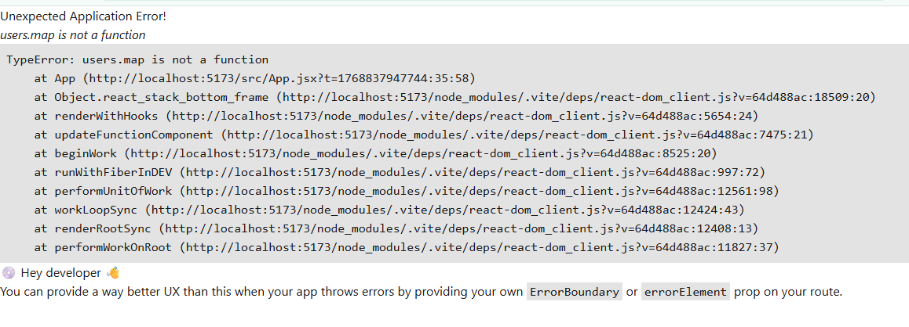
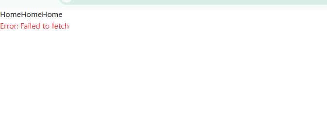
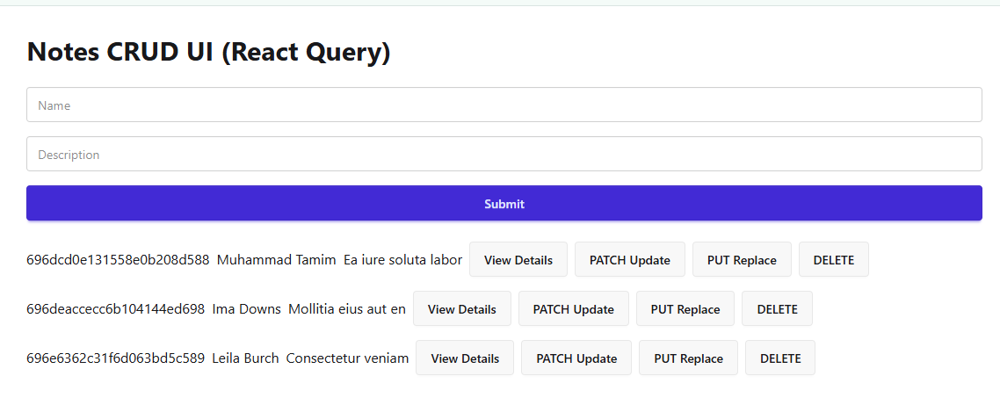

<h1 align="center">Tanstack Query Notes</h1>

- [Setup:](#setup)
- [Introduction:](#introduction)
    - [Why Use TanStack Query?](#why-use-tanstack-query)
      - [with fetch + useState, and useEffect:](#with-fetch--usestate-and-useeffect)
      - [with axios + useState, and useEffect:](#with-axios--usestate-and-useeffect)
      - [with Tanstack Query + axios:](#with-tanstack-query--axios)
- [HTTP Operations (CRUD):](#http-operations-crud)
  - [Query key:](#query-key)
  - [Query Function:](#query-function)
  - [Query Invalidation:](#query-invalidation)
- [Pagination:](#pagination)
- [Infinite Scrolling:](#infinite-scrolling)
- [Initial Query Data vs Placeholder Query Data:](#initial-query-data-vs-placeholder-query-data)
  - [Initial Data:](#initial-data)
  - [Placeholder Data:](#placeholder-data)
- [Prefetching:](#prefetching)
  - [Example 1:](#example-1)
  - [Example 2:](#example-2)


# Setup: 

```bash
npm i @tanstack/react-query @tanstack/react-query-devtools
```

For next.js: 

```tsx
// src/app/providers.tsx

'use client'

import { QueryClient, QueryClientProvider } from '@tanstack/react-query'
import { ReactQueryDevtools } from '@tanstack/react-query-devtools'

export default function Providers({ children }: { children: React.ReactNode }) {
    const queryClient = new QueryClient()

    return (
        <QueryClientProvider client={queryClient}>
            {children}
            <ReactQueryDevtools initialIsOpen={false} />
        </QueryClientProvider>
    )
}
```

```tsx
// src/app/layout.tsx

import type { Metadata } from 'next'
import './globals.css'
import Providers from './providers'

export const metadata: Metadata = {
  title: 'Clerk Next.js Quickstart',
  description: 'Generated by create next app',
}

export default function RootLayout({
  children,
}: {
  children: React.ReactNode
}) {
  return (
    <html lang="en">
      <body>
        <Providers>
          {children}
        </Providers>
      </body>
    </html>
  )
}
```

For react and react router: 

```tsx
// main.jsx

import { StrictMode } from 'react'
import { createRoot } from 'react-dom/client';
import './index.css'
import { createBrowserRouter, RouterProvider } from 'react-router';
import { QueryClient, QueryClientProvider } from '@tanstack/react-query'
import { ReactQueryDevtools } from '@tanstack/react-query-devtools'
import App from './App';


const router = createBrowserRouter([
  {
    path: '/',
    Component: App,
  },
])

const queryClient = new QueryClient()

createRoot(document.getElementById('root')).render(
  <StrictMode>
    <QueryClientProvider client={queryClient}>
      <RouterProvider router={router}></RouterProvider>
      <ReactQueryDevtools initialIsOpen={false} />
    </QueryClientProvider>
  </StrictMode>,
)
```

# Introduction:
TanStack Query is a server-state management library for React that simplifies handling asynchronous data from APIs.

It provides built-in support for:
- data fetching
- mutations (POST, PUT, DELETE)
- caching
- background refetching
- loading & error states
- pagination & infinite queries

**Note:** It replaces most manual data-fetching logic written with useEffect and useState

### Why Use TanStack Query?

#### with fetch + useState, and useEffect: 

```js
import { useEffect, useState } from "react";

function App() {
  const [users, setUsers] = useState([]);
  const [pending, setPending] = useState(true);
  const [error, setError] = useState(null);

  useEffect(() => {
    fetch("https://jsonplaceholder.typicode.com/use")
      .then((res) => res.json())
      .then((data) => {
        setUsers(data);
        setPending(false);
      })
      .catch((err) => {
        setError(err.message);
        setPending(false);
      });
  }, []);

  if (pending) {
    return <h2 className="text-center text-5xl">Loading......</h2>;
  }

  if (error) {
    return <h2 className="text-red-500">Error: {error}</h2>;
  }

  return (
    <div>
      {users.map((user) => <div key={user.id}>
        <p>{user.name} | {user.email}</p>
      </div>)}
    </div >
  );
}

export default App;
```



Note: this version don't catch fetch error properly becaus fetch only throw error for network failure, not for 4xx or 5xx response status. for that type of error handling we need to check response.ok property. 

```js
import { useEffect, useState } from "react";

function App() {
  const [users, setUsers] = useState([]);
  const [pending, setPending] = useState(true);
  const [error, setError] = useState(null);

  useEffect(() => {
    fetch("https://jsodfdfdfdfdfdfder.typicode.com/use")
      .then((res) => {
        if (!res.ok) {
          throw new Error(`Request failed with status ${res.status}`);
        }
        return res.json();
      })
      .then((data) => {
        setUsers(data);
        setPending(false);
      })
      .catch((err) => {
        setError(err.message);
        setPending(false);
      });
  }, []);

  if (pending) {
    return <h2 className="text-center text-5xl">Loading......</h2>;
  }

  if (error) {
    return <h2 className="text-red-500">Error: {error}</h2>;
  }

  return (
    <div>
      {users.map((user) => (
        <div key={user.id}>
          <p>{user.name} | {user.email}</p>
        </div>
      ))}
    </div>
  );
}

export default App;
```



#### with axios + useState, and useEffect: 

```js
import { useEffect, useState } from "react";
import axios from "axios";

function App() {
  const [users, setUsers] = useState([]);
  const [pending, setPending] = useState(true);
  const [error, setError] = useState(null);

  useEffect(() => {
    axios.get("https://wrongURl.com/users")
      .then((res) => {
        setUsers(res.data);
        setPending(false);
      })
      .catch((err) => {
        setError(err.message);
        setPending(false);
      });
  }, []);

  if (pending) {
    return <h2 className="text-center text-5xl">Loading......</h2>;
  }

  if (error) {
    return <h2 className="text-red-500">Error: {error}</h2>;
  }

  return (
    <div>
      {users.map((user) => (
        <div key={user.id}>
          <p>
            {user.name} | {user.email}
          </p>
        </div>
      ))}
    </div>
  );
}

export default App;
```


Note: This axios version is better than fetch version because axios throw error for 4xx and 5xx response status by default.

#### with Tanstack Query + axios: 

```js
import axios from "axios";
import { useQuery } from "@tanstack/react-query";

const fetchUsers = async () => {
  const res = await axios.get("https://.typicode.com/users");
  return res.data;
};

function App() {
  const { data: users, isLoading, isError, error } = useQuery({
    queryKey: ["users"],
    queryFn: fetchUsers,
  });

  if (isLoading) {
    return <h2 className="text-center text-5xl">Loading......</h2>;
  }

  if (isError) {
    return <h2 className="text-red-500">Error: {error.message}</h2>
  }

  return (
    <div>
      {users.map((user) => <div key={user.id}>
        <p>{user.name} | {user.email}</p>
      </div>
      )}
    </div>
  );
}

export default App;
```


Note: tanstack query is really advance, if we put wrong url in the axios get method, it will automatically retry 3 times before throwing error. 


fix url version: 

```js
import axios from "axios";
import { useQuery } from "@tanstack/react-query";

const fetchUsers = async () => {
  const res = await axios.get("https://jsonplaceholder.typicode.com/users");
  return res.data;
};

function App() {
  const { data: users, isLoading, isError, error } = useQuery({
    queryKey: ["users"],
    queryFn: fetchUsers,
  });

  if (isLoading) {
    return <h2 className="text-center text-5xl">Loading......</h2>;
  }

  if (isError) {
    return <h2 className="text-red-500">Error: {error.message}</h2>
  }

  return (
    <div>
      {users.map((user) => <div key={user.id}>
        <p>{user.name} | {user.email}</p>
      </div>
      )}
    </div>
  );
}

export default App;
```


here, we can now see tanstack query by default handle loading, error and data states. we don't need to manually create useState and useEffect for that.

# HTTP Operations (CRUD): 

| HTTP        | TanStack      |
| ----------- | ------------- |
| GET         | `useQuery`    |
| POST        | `useMutation` |
| PUT / PATCH | `useMutation` |
| DELETE      | `useMutation` |


**Note:** In tanstack query GET operation is handled by useQuery hook and its called **Query operation**. while POST, PUT/PATCH and DELETE operations are handled by useMutation hook and its called **Mutation Operation**.

- Backend: 

```js
const express = require('express')
const cors = require('cors')
require('dotenv').config()
const { MongoClient, ServerApiVersion, ObjectId } = require('mongodb');

const port = process.env.PORT || 3000

const app = express()
app.use(cors()) // use cors middleware
app.use(express.json()) // use express middleware


const client = new MongoClient(process.env.MONGODB_URI, {
    serverApi: {
        version: ServerApiVersion.v1,
        strict: true,
        deprecationErrors: true,
    }
});

async function run() {

    const notesCollection = client.db("notesDB").collection('notes')


    // POST - create new note
    app.post('/note', async (req, res) => {
        const note = req.body;
        const result = await notesCollection.insertOne(note);
        res.send(result);
    });


    // GET all notes
    app.get('/notes', async (req, res) => {
        const notes = await notesCollection.find({}).toArray();
        res.send(notes);
    });

    // GET a single note
    app.get('/note/:id', async (req, res) => {
        const id = req.params.id
        const filter = { _id: new ObjectId(id) }
        const result = await notesCollection.findOne(filter);
        res.send(result);
    });


    // PATCH - partial update
    app.patch('/note/:id', async (req, res) => {
        const id = req.params.id
        const filter = { _id: new ObjectId(id) }
        const updatedData = req.body;
        const updatedDoc = {
            $set: {
                name: updatedData.name,
                description: updatedData.description
            }
        }

        const result = await notesCollection.updateOne(filter, updatedDoc);
        res.send(result);
    });

    // DELETE
    app.delete('/note/:id', async (req, res) => {
        const result = await notesCollection.deleteOne({ _id: new ObjectId(req.params.id) });
        res.send(result);
    });

    // Send a ping to confirm a successful connection
    await client.db("admin").command({ ping: 1 });
    console.log("Pinged your deployment. You successfully connected to MongoDB!");
}
run().catch(console.dir);


app.get('/', (req, res) => {
    res.send('Hello World!')
})

app.listen(port, () => {
    console.log(`Example app listening on port ${port}`)
})
```

- Frontend: 

```js
// src/api/notes.api.js

import { baseApi } from "./baseApi"

export const notesApi = {
    createNote: async (note) => {
        const res = await baseApi.post('/note', note);
        return res.data
    },

    getNotes: async () => {
        const res = await baseApi.get('/notes')
        return res.data
    },

    getNote: async (id) => {
        const res = await baseApi.get(`/note/${id}`)
        return res.data
    },

    updateNote: async (id, data) => {
        const res = await baseApi.patch(`/note/${id}`, data)
        return res.data
    },

    deleteNote: async (id) => {
        const res = await baseApi.delete(`/note/${id}`)
        return res.data
    }
}
```

```jsx
// src/hooks/notes/useCreateNote.jsx

import { useMutation, useQueryClient } from "@tanstack/react-query";
import { notesApi } from "../../api/notes.api";

export default function useCreateNote() {
    const queryClient = useQueryClient()
    return useMutation({
        mutationFn: (data) => notesApi.createNote(data),
        onSuccess: () => {
            queryClient.invalidateQueries({ queryKey: ['notes'] })
        }
    })
}
```

```jsx
// src/hooks/notes/useGetNotes.jsx

import { useQuery } from "@tanstack/react-query";
import { notesApi } from "../../api/notes.api";

export default function useGetNotes() {
    return useQuery({
        queryKey: ['notes'],
        queryFn: notesApi.getNotes
    })
}
```

```jsx
// src/hooks/notes/useGetNote.jsx

import { useQuery } from "@tanstack/react-query";
import { notesApi } from "../../api/notes.api";

export default function useGetNote(id) {
    return useQuery({
        queryKey: ['note', id],
        queryFn: () => notesApi.getNote(id),
        enabled: !!id,
    })
}
```

```jsx
// src/hooks/notes/useUpdateNote.jsx

import { useMutation, useQueryClient } from '@tanstack/react-query'
import { notesApi } from '../../api/notes.api'

export default function useUpdateNote() {
    const queryClient = useQueryClient()
    return useMutation({
        mutationFn: ({ id, data }) => notesApi.updateNote(id, data),
        onSuccess: (_, { id }) => {
            queryClient.invalidateQueries({ queryKey: ["notes"] })
            queryClient.invalidateQueries({ queryKey: ["note", id] })
        }
    })
}
```

```jsx
// // src/hooks/notes/useDeleteNote.jsx

import { useMutation, useQueryClient } from '@tanstack/react-query'
import { notesApi } from '../../api/notes.api'

export default function useDeleteNote() {
    const queryClient = useQueryClient()
    return useMutation({
        mutationFn: ({ id }) => notesApi.deleteNote(id),
        onSuccess: (_, {id}) => {
            queryClient.invalidateQueries({ queryKey: ['notes'] })
            queryClient.removeQueries({ queryKey: ['note', id] })
        }
    })
}
```

```jsx
import React, { useState } from 'react';
import useGetNotes from '../hooks/notes/useGetNotes';
import useCreateNote from '../hooks/notes/useCreateNote';
import useGetNote from '../hooks/notes/useGetNote';
import useDeleteNote from '../hooks/notes/useDeleteNote';
import useUpdateNote from '../hooks/notes/useUpdateNote';


const HomePage = () => {
    const [id, setId] = useState(null);
    const [updateForm, setUpdateForm] = useState({
        name: "",
        description: ""
    });

    const { data: notes, isLoading, isError, error } = useGetNotes()
    const { data: note } = useGetNote(id)
    const { mutate: createNote } = useCreateNote()
    const { mutate: updateNote } = useUpdateNote()
    const { mutate: deleteNote } = useDeleteNote()


    const handleSubmit = (e) => {
        e.preventDefault();
        const name = e.target.name.value;
        const description = e.target.description.value;
        const data = { name, description }
        createNote(data);
        e.target.reset();
    };

    const handleUpdate = (e) => {
        e.preventDefault();
        const data = updateForm;
        updateNote({ id, data })
    };

    const handleDelete = (id) => {
        deleteNote({ id });
    };

    if (isLoading) {
        return <h2 className="text-center text-5xl">Loading......</h2>;
    }

    if (isError) {
        return <h2 className="text-red-500">Error: {error.message}</h2>
    }

    return (
        <div className="p-8 max-w-6xl mx-auto">
            <h1 className="text-3xl font-bold mb-6">Notes CRUD UI (React Query)</h1>

            {/* Form */}
            <form onSubmit={handleSubmit} className="mb-6 space-y-4">
                <input type="text" name="name" placeholder="Name" className="input w-full" />
                <input type="text" name="description" placeholder="Description" className="input w-full" />
                <input type="submit" value="Submit" className="btn w-full btn-primary" />
            </form>

            {/* Notes List */}
            <div className="space-y-4">
                {notes.map((note) => (
                    <div key={note._id} className="flex items-center gap-2">
                        <p>{note._id}</p>
                        <p>{note.name}</p>
                        <p>{note.description}</p>

                        <button className='btn' onClick={() => {
                            setId(note._id);
                            document.getElementById("my_modal_1").showModal();
                        }}>Details</button>

                        <button className='btn' onClick={() => {
                            setId(note._id);
                            document.getElementById("my_modal_2").showModal();
                            setUpdateForm({
                                name: note.name,
                                description: note.description
                            });
                        }}>Update</button>

                        <button className='btn' onClick={() => handleDelete(note._id)}>Delete</button>

                    </div>
                ))}
            </div>

            <dialog id="my_modal_1" className="modal">
                <div className="modal-box">
                    <p>id: {note?._id}</p>
                    <p>Name: {note?.name}</p>
                    <p>Description: {note?.description}</p>
                    <div className="modal-action">
                        <form method="dialog">
                            {/* if there is a button in form, it will close the modal */}
                            <button className="btn" onClick={() => setId(null)}>Close</button>
                        </form>
                    </div>
                </div>
            </dialog>

            <dialog id="my_modal_2" className="modal">
                <div className="modal-box">
                    <form onSubmit={handleUpdate} className="mb-6 space-y-4">
                        <input type="text" name="name" value={updateForm.name} onChange={(e) => setUpdateForm({ ...updateForm, name: e.target.value })} className="input w-full" />
                        <input type="text" name="description" value={updateForm.description} onChange={(e) => setUpdateForm({ ...updateForm, description: e.target.value })} className="input w-full" />
                        <input type="submit" value="Submit" className="btn w-full btn-primary" />
                    </form>
                    <div className="modal-action">
                        <form method="dialog">
                            {/* if there is a button in form, it will close the modal */}
                            <button className="btn" onClick={() => setId(null)}>Close</button>
                        </form>
                    </div>
                </div>
            </dialog>


        </div>
    );
};

export default HomePage;
```




Here, 

In Queries (GET) we use useQuery hook, it requires two core properties: 
- queryKey: unique identifier
- queryFn: function that fetches data

And in Mutation (POST, PUT/PATCH, DELETE) we use useMutation hook, it also requires two core properties: 
- mutationFn → function that fetches data
- onSuccess → runs after a successful mutation (used for query invalidation, delete etc.)

## Query key:
queryKey is a unique identifier for a query. It is used internally for: 
- caching
- refetching
- deduplication
- sharing data across components

Here each query key is different to each others.

```js
queryKey: ["users"] ✅
queryKey: ["users", userId] ✅
queryKey: ["users", { page: 1 }] ✅
queryKey: ['todo', 5, { preview: true }] ✅
```

**Note:** Object keys are hashed deterministically, means that no matter the order of keys in objects, all of the following queries are considered equal.

```js
queryKey: ['todos', { status, page }]
queryKey: ['todos', { page, status }]
queryKey: ['todos', { page, status, other: undefined }]
```

but the following query keys are not equal because Array items order matters: 

```js
queryKey: ['todos', status, page]
queryKey: ['todos', page, status]
queryKey: ['todos', undefined, page, status]
```

**Note:** At scale, define keys centrally:

```js
const queryKeys = {
  users: ["users"],
  user: (id) => ["users", id],
};
```

then use it: 

```js
queryKey: queryKeys.user(userId)
```


## Query Function: 
A query function can be literally any function that returns a promise. The promise that is returned should either resolve the data or throw an error. means it's responsible for fetching data. 

fetching users: 

```js
const fetchUsers = async () => {
  const res = await axios.get("https://jsonplaceholder.typicode.com/users");
  return res.data;
};

const { data: users, isLoading, isError, error } = useQuery({
    queryKey: ["users"],
    queryFn: fetchUsers,
  });
```

or if we don't want to use axios: 

```js
const fetchUsers = async () => {
  const res = await fetch("https://jsonplaceholder.typicode.com/users");
  return res.json();
};

const { data: users, isLoading, isError, error } = useQuery({
  queryKey: ["users"],
  queryFn: fetchUsers,
});
```

or if we don't want to use async/await: 

```js
const fetchUsers = () => { 
  return fetch("https://jsonplaceholder.typicode.com/users")
    .then(res => res.json())
};

const { data: users, isLoading, isError, error } = useQuery({
  queryKey: ["users"],
  queryFn: fetchUsers,
});

/*
 * OR
 const fetchUsers = () =>
  fetch("https://jsonplaceholder.typicode.com/users")
    .then(res => res.json()); 
*/
```

Below All of the following are valid query function configurations:

```js
useQuery({ queryKey: ['todos'], queryFn: fetchAllTodos })
useQuery({ queryKey: ['todos', todoId], queryFn: () => fetchTodoById(todoId) })
useQuery({
  queryKey: ['todos', todoId],
  queryFn: async () => {
    const data = await fetchTodoById(todoId)
    return data
  },
})
useQuery({
  queryKey: ['todos', todoId],
  queryFn: ({ queryKey }) => fetchTodoById(queryKey[1]),
})
```

## Query Invalidation: 

- Invalidate every query in the cache: 

```js
queryClient.invalidateQueries()
```

- Invalidate every query with a key that starts with `notes`:

```js
onSuccess: () => {
  queryClient.invalidateQueries({ queryKey: ['notes'] })
}

/*
// Both queries below will be invalidated

  queryKey: ['notes'],
  queryKey: ['notes', { page: 1 }],
  queryKey: ['notes', { type: 'done' }]
*/
```

- Invalidate only the query with the exact key that is `notes`:

```js
queryClient.invalidateQueries({
  queryKey: ['todos'],
  exact: true,
})

// queryKey: ['todos'], // will be invalidated
// queryKey: ['todos', { page: 1 }], // will NOT be invalidated

```

# Pagination: 
Tanstack Query provides built-in support for pagination. The key part is to use the `keepPreviousData` option in the useQuery hook. This allows you to keep showing the previous page's data while the new page's data is being fetched, which provides a better user experience. Means instead of showing a loading state when the page changes, it will keep showing the old data until the new data is loaded.

```js
import axios from "axios";
import { useQuery, keepPreviousData } from "@tanstack/react-query";
import { useState } from "react";

const fetchUsers = async (page) => {
  await new Promise((res) => setTimeout(res, 1500)); // simulate slow API
  const res = await axios.get(`https://jsonplaceholder.typicode.com/users`, {
    params: { _page: page, _limit: 3 }
  });

  return res.data;
};

function App() {
  const [page, setPage] = useState(1);

  const { data: users, isLoading, isError, error, isFetching } = useQuery({
    queryKey: ["users", page],
    queryFn: () => fetchUsers(page),
    // 🔥 KEY PART
    placeholderData: keepPreviousData,
  });

  if (isLoading) {
    return <h2 className="text-center text-5xl">Loading......</h2>;
  }

  if (isError) {
    return <h2 className="text-red-500">Error: {error.message}</h2>;
  }

  return (
    <div>
      <h1 className="text-2xl mb-4">Users - Page {page}</h1>

      {users?.map((user) => (
        <div key={user.id}>
          <p>{user.name} | {user.email}</p>
        </div>
      ))}

      {/* 🔽 Pagination Controls */}
      <div className="mt-4 flex gap-4">
        <button onClick={() => setPage((old) => Math.max(old - 1, 1))} disabled={page === 1} className="btn">
          Previous
        </button>

        <button onClick={() => setPage((old) => old + 1)} className="btn">
          Next
        </button>
      </div>

      {/* 🔄 Background fetching indicator */}
      {isFetching && <p className="text-sm">Fetching...</p>}
    </div>
  );
}

export default App;
```

# Infinite Scrolling: 
Infinite scrolling is a pattern where more data is loaded as the user scrolls down under the previous data, instead of having traditional pagination with new data loaded for each page.

Tanstack Query also provides built-in support for infinite scrolling through the useInfiniteQuery hook. This is useful when you want to load more data as the user scrolls down, without having to click on a "Load More" button. The key part is to use the `getNextPageParam` option to tell Tanstack Query how to get the next page's parameters based on the last page's data. 


```jsx
import React, { useEffect } from "react";
import { useInfiniteQuery } from "@tanstack/react-query";
import axios from "axios";

const fetchPhotos = async ({ pageParam = 1 }) => {
  await new Promise((res) => setTimeout(res, 1500)); // simulate slow API
  const res = await axios.get(
    "https://jsonplaceholder.typicode.com/photos",
    {
      params: { _page: pageParam, _limit: 10 },
    }
  );
  return res.data;
};

function App() {
  const { data, error, fetchNextPage, hasNextPage, isFetching, isFetchingNextPage, status } = useInfiniteQuery({
    queryKey: ["photos"],
    queryFn: fetchPhotos,
    initialPageParam: 1,
    getNextPageParam: (lastPage, pages) => {
      if (lastPage.length === 0) return undefined;
      return pages.length + 1;
    },
  });

  // 🔥 SIMPLE SCROLL LOGIC
  useEffect(() => {
    const handleScroll = () => {
      const bottom =
        window.innerHeight + window.scrollY >=
        document.documentElement.scrollHeight - 100;

      if (bottom && hasNextPage && !isFetchingNextPage) {
        fetchNextPage();
      }
    };

    window.addEventListener("scroll", handleScroll);

    return () => window.removeEventListener("scroll", handleScroll);
  }, [fetchNextPage, hasNextPage, isFetchingNextPage]);

  if (status === "pending") return <p>Loading...</p>;
  if (status === "error") return <p>Error: {error.message}</p>;

  return (
    <div>
      <h1>Photos: {data.pages.flat().length}</h1>

      {/* 🔹 render all pages */}
      {data.pages.map((group, i) => (
        <React.Fragment key={i}>
          {group.map((photo) => (
            <div key={photo.id}>
              <p>{photo.title}</p>
              <p>{photo.url}</p>
              <p>{photo.thumbnailUrl}</p>
            </div>
          ))}
        </React.Fragment>
      ))}

      {/* 🔹 loading state */}
      {isFetchingNextPage && <p className="text-center text-red-500 text-6xl">Loading more...</p>}
      {/* fetching state */}
      {isFetching && !isFetchingNextPage && <p className="text-center text-blue-500 text-6xl">Fetching...</p>}
    </div>
  );
}

export default App;
```

# Initial Query Data vs Placeholder Query Data:
For a normal query: 

```js
import axios from "axios";
import { useQuery } from "@tanstack/react-query";

const fetchUsers = async () => {
  const res = await axios.get("https://jsonplaceholder.typicode.com/users");
  return res.data;
};

function App() {
  const { data: users, isLoading, isError, error } = useQuery({
    queryKey: ["users"],
    queryFn: fetchUsers,
  });

  if (isLoading) {
    return <h2 className="text-center text-5xl">Loading......</h2>;
  }

  if (isError) {
    return <h2 className="text-red-500">Error: {error.message}</h2>
  }

  return (
    <div>
      {users.map((user) => <div key={user.id}>
        <p>{user.name} | {user.email}</p>
      </div>
      )}
    </div>
  );
}

export default App;
```

here Every time: Component mounts → Loading → Fetch → Show data

But if we want to skip loading state on first mount and show some data before fetch completes, we can use two query options: 
- `initialData`: Means we already have some real data to show before fetch, so we can show it immediately without loading state. but this data will be replaced by the fetched data once it arrives. It's useful when we have to show details page and for that details page we already have some data.
  
- `placeholderData`: Means we have some temporary data to show while the query is loading. This data is not used if the query function has already fetched data before. It is only shown during the loading state of the query. If the query function fails, the placeholderData will not be used and the error state will be set.

**Note:** 
- Use initialData when:
  - data already exists
  - you want instant real UI
- Use placeholderData when:
  - you need loading UI
  - data is not available yet

## Initial Data: 

```jsx
import axios from "axios";
import { useQuery } from "@tanstack/react-query";
import { Link } from "react-router";

const fetchUsers = async () => {
  const res = await axios.get("https://jsonplaceholder.typicode.com/users");
  return res.data;
};


function App() {
  const { data: users, isLoading, isError, error } = useQuery({
    queryKey: ["users"],
    queryFn: fetchUsers,
  });

  if (isLoading) {
    return <h2 className="text-center text-5xl">Loading......</h2>;
  }

  if (isError) {
    return <h2 className="text-red-500">Error: {error.message}</h2>
  }

  return (
    <div>
      {users.map((user) => <div key={user.id}>
        <p>{user.name} | {user.email} | <Link to={`/details/${user.id}`}><button className="btn">Details</button></Link></p>
      </div>
      )}
    </div>
  );
}

export default App;
```

```jsx
import { useQuery, useQueryClient } from '@tanstack/react-query';
import axios from 'axios';
import React from 'react';
import { useParams } from 'react-router';

const fetchUserById = async (id) => {
    const res = await axios.get(
        `https://jsonplaceholder.typicode.com/users/${id}`
    );
    return res.data;
};

const DetailsPage = () => {
    const queryClient = useQueryClient();

    const { id } = useParams()
    const { data: user, isLoading, isError, error } = useQuery({
        queryKey: ["user", id],
        queryFn: () => fetchUserById(id),

        // 🔥 USE EXISTING CACHE AS INITIAL DATA
        initialData: () => {
            const users = queryClient.getQueryData(["users"]);
            return users?.find((u) => u.id === parseInt(id));
        },

        initialDataUpdatedAt: () =>
            queryClient.getQueryState(["users"])?.dataUpdatedAt,

        staleTime: 1000 * 60 * 5, // 5 minutes
    });

    if (isLoading) {
        return <h2 className="text-center text-5xl">Loading......</h2>;
    }

    if (isError) {
        return <h2 className="text-red-500">Error: {error.message}</h2>
    }

    return (
        <div>
            <h2 className="text-3xl font-bold mb-4">{user.name}</h2>
            <p><strong>Email:</strong> {user.email}</p>
            <p><strong>Phone:</strong> {user.phone}</p>
            <p><strong>Website:</strong> {user.website}</p>
        </div>
    );
};

export default DetailsPage;
```

## Placeholder Data: 

```jsx
import { useQuery } from '@tanstack/react-query';
import axios from 'axios';
import React from 'react';
import { useParams } from 'react-router';

const fetchUserById = async (id) => {
    const res = await axios.get(
        `https://jsonplaceholder.typicode.com/users/${id}`
    );
    return res.data;
};

const DetailsPage = () => {
    const { id } = useParams()
    const { data: user, isLoading, isError, error } = useQuery({
        queryKey: ["user", id],
        queryFn: () => fetchUserById(id),

        placeholderData: {
            name: "Loading...",
            email: "loading@example.com",
            phone: "000000000",
            website: "loading...",
        },
    });

    if (isLoading) {
        return <h2 className="text-center text-5xl">Loading......</h2>;
    }

    if (isError) {
        return <h2 className="text-red-500">Error: {error.message}</h2>
    }

    return (
        <div>
            <h2 className="text-3xl font-bold mb-4">{user.name}</h2>
            <p><strong>Email:</strong> {user.email}</p>
            <p><strong>Phone:</strong> {user.phone}</p>
            <p><strong>Website:</strong> {user.website}</p>
        </div>
    );
};

export default DetailsPage;
```

# Prefetching: 
Prefetching = loading data into the cache before it’s needed.

- Without prefetch: User clicks → fetch starts → loading spinner 😴
- With prefetch: User clicks → data already cached → instant render ⚡

## Example 1: 

```jsx
// src/api/users.js
import axios from "axios";

export const fetchUsers = async () => {
    const res = await axios.get("https://jsonplaceholder.typicode.com/users");
    return res.data;
};

export const fetchUserById = async (id) => {
    const res = await axios.get(
        `https://jsonplaceholder.typicode.com/users/${id}`
    );
    return res.data;
};
```

```jsx
import { useQuery, useQueryClient } from "@tanstack/react-query";
import { Link } from "react-router";
import { fetchUsers, fetchUserById } from "./api/users";

function App() {
  const queryClient = useQueryClient();

  const { data: users, isLoading, isError, error } = useQuery({
    queryKey: ["users"],
    queryFn: fetchUsers,
    staleTime: 1000 * 60 * 5, // optional but good
  });

  const prefetchUser = (id) => {
    queryClient.prefetchQuery({
      queryKey: ["user", id],
      queryFn: () => fetchUserById(id),
      staleTime: 1000 * 60 * 5,
    });
  };

  if (isLoading) {
    return <h2 className="text-center text-5xl">Loading......</h2>;
  }

  if (isError) {
    return <h2 className="text-red-500">Error: {error.message}</h2>;
  }

  return (
    <div>
      {users.map((user) => (
        <div key={user.id}>
          <p>
            {user.name} | {user.email} |{" "}
            <Link
              to={`/details/${user.id}`}
              onMouseEnter={() => prefetchUser(user.id)}
            >
              <button className="btn">Details</button>
            </Link>
          </p>
        </div>
      ))}
    </div>
  );
}

export default App;
```

```jsx
import { useQuery } from "@tanstack/react-query";
import { useParams } from "react-router";
import { fetchUserById } from "./api/users";

const DetailsPage = () => {
    const { id } = useParams();
    const idNum = Number(id); // ensure consistent query key

    const { data: user, isLoading, isError, error } = useQuery({
        queryKey: ["user", idNum],
        queryFn: () => fetchUserById(idNum),
        staleTime: 1000 * 60 * 5, // MUST match prefetch
        // Prefetch only fires when data is older than the staleTime,
       // so in a case like this you definitely want to set one
    });

    if (isLoading) {
        return <h2 className="text-center text-5xl">Loading......</h2>;
    }

    if (isError) {
        return <h2 className="text-red-500">Error: {error.message}</h2>;
    }

    return (
        <div>
            <h2 className="text-3xl font-bold mb-4">{user.name}</h2>
            <p><strong>Email:</strong> {user.email}</p>
            <p><strong>Phone:</strong> {user.phone}</p>
            <p><strong>Website:</strong> {user.website}</p>
        </div>
    );
};

export default DetailsPage;
```

## Example 2: 

```jsx
const handleClick = async () => {
  await queryClient.prefetchQuery({
    queryKey: ["user", user.id],
    queryFn: () => fetchUserById(user.id),
  });

  navigate(`/users/${user.id}`);
};
```